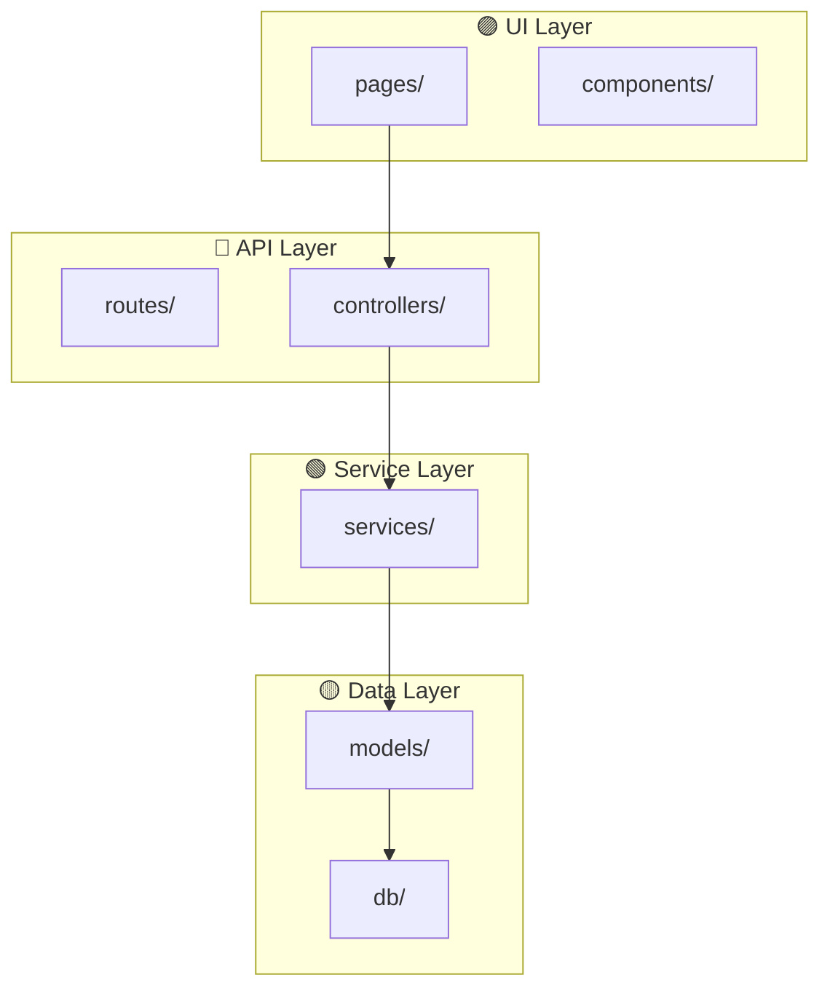
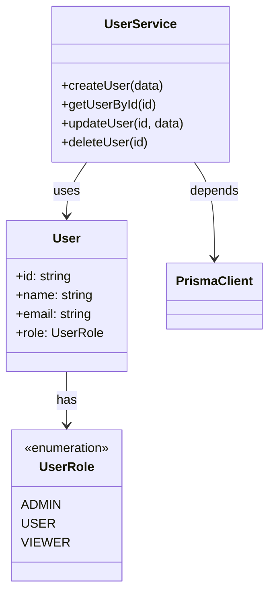
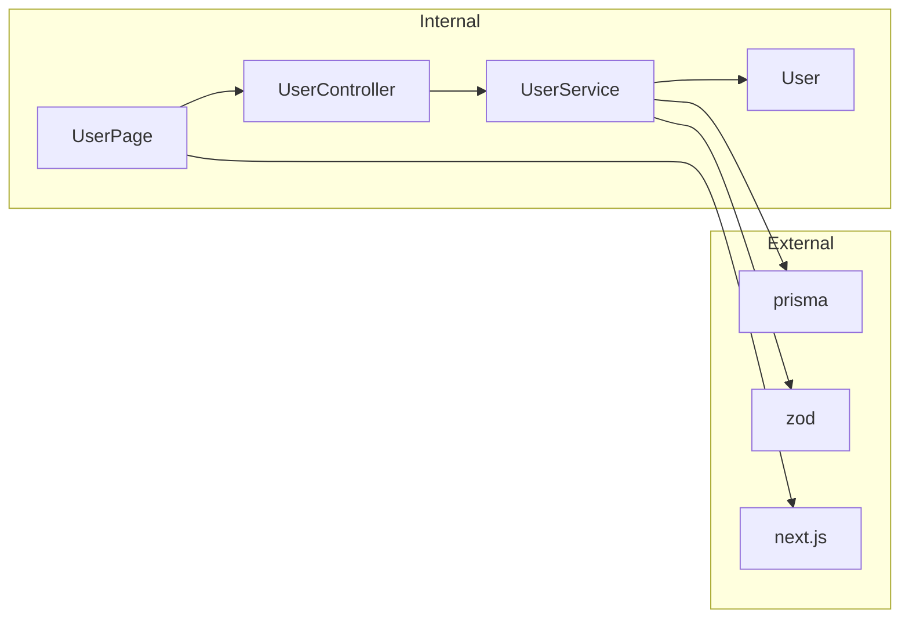

# Codebase Graph — Qualquer Codebase → Grafo Navegável

> **"Entenda a arquitetura em minutos, não dias."**

## 📁 File Structure
- `SKILL.md` — Você está aqui. Workflow completo abaixo.
- `references/extraction-patterns.md` — Padrões de extração por linguagem.
- `gotchas.md` — ⚠️ Problemas conhecidos.

## 🔗 Related Skills
- `mermaid-diagrams` — Engine de renderização dos grafos (usa Mermaid.js)
- `smart-explore` — Exploração progressiva que alimenta o grafo
- `knowledge-graph` — Memory graph (diferente: este é para CÓDIGO, aquele é para MEMÓRIA)
- `data-charts` — Para visualizações complementares (ex: treemap de LOC por módulo)

---

## 1. Overview

### O que esta skill faz

Analisa uma codebase e gera um **grafo de conhecimento navegável** com:
- **Entidades:** Arquivos, classes, funções, interfaces, types, enums, constantes
- **Relações:** Imports, exports, herança, composição, chamadas, dependências
- **Camadas:** API, Service, Data, UI, Utility, Config, Test (classificação automática)
- **Output:** Mermaid diagrams + HTML interativo + JSON estruturado

### Quando usar

| Cenário | Esta skill |
|---------|------------|
| Onboarding em codebase desconhecida | ✅ Mapa completo em minutos |
| Análise de impacto antes de refactor | ✅ "O que depende desse módulo?" |
| Documentação de arquitetura | ✅ Diagramas auto-gerados |
| Code review de PRs grandes | ✅ Visualizar o que mudou no grafo |
| Debug de dependências circulares | ✅ Detecta ciclos |

### vs. Understand-Anything

| Aspecto | Esta skill | Understand-Anything |
|---------|-----------|---------------------|
| **Dependências** | Zero (LLM-native) | pnpm, React, Vite, React Flow |
| **Visualização** | Mermaid + HTML simples | React Flow dashboard completo |
| **Instalação** | Nenhuma | Plugin install necessário |
| **Customização** | Totalmente controlável | Framework-bound |
| **Escala** | Até ~500 arquivos (LLM context) | Persistente (.understand-anything/) |
| **Ideal para** | Análises pontuais, Claude Code nativo | Dashboard contínuo de projeto grande |

**Decisão:** Para nosso uso (análises pontuais, múltiplos projetos pequenos-médios), a abordagem LLM-native é mais prática. Se um projeto crescer muito, considerar instalar Understand-Anything como complemento.

---

## 2. Workflow

### Modo QUICK — Visão Geral (1-2 min)

Para ter uma visão de alto nível rápida.

**Passo 1 — Descobrir estrutura:**
```
Usar Glob para mapear arquivos por tipo:
  **/*.ts, **/*.tsx, **/*.js, **/*.jsx  → Frontend/API
  **/*.py                                → Backend Python
  **/package.json, **/requirements.txt   → Dependências
  **/*.test.*, **/*.spec.*               → Testes
```

**Passo 2 — Classificar camadas:**
```
Regras de classificação automática:
  /api/, /routes/, /controllers/  → 🔵 API Layer
  /services/, /usecases/          → 🟢 Service Layer
  /models/, /entities/, /db/      → 🟡 Data Layer
  /components/, /pages/, /views/  → 🟣 UI Layer
  /utils/, /helpers/, /lib/       → ⚪ Utility Layer
  /config/, /env/, /settings/     → ⚙️ Config Layer
  /test/, /spec/, /__tests__/     → 🧪 Test Layer
```

**Passo 3 — Gerar Mermaid de alto nível:**


### Modo STANDARD — Entidades e Relações (5-10 min)

Para entender a arquitetura real com entidades concretas.

**Passo 1 — Extrair entidades por arquivo:**

Para cada arquivo relevante, extrair usando leitura + análise:

```
Entidade = {
  id: "src/services/UserService.ts",
  type: "class" | "function" | "interface" | "type" | "enum" | "constant",
  name: "UserService",
  layer: "Service",
  exports: ["UserService", "createUser", "getUserById"],
  imports: [
    { from: "../models/User", names: ["User", "UserRole"] },
    { from: "../db/prisma", names: ["prisma"] }
  ],
  methods: ["createUser", "getUserById", "updateUser", "deleteUser"],
  loc: 142
}
```

**Passo 2 — Construir relações:**

```
Tipos de relação:
  IMPORTS    → A importa de B (mais comum)
  EXTENDS    → A herda de B (class extends)
  IMPLEMENTS → A implementa B (interface)
  COMPOSES   → A usa instância de B (composição)
  CALLS      → Função A chama Função B
  DEPENDS    → package.json / requirements.txt
```

**Passo 3 — Gerar diagrama de classes Mermaid:**



**Passo 4 — Gerar grafo de dependências:**



### Modo DEEP — Análise Completa (15-30 min)

Para documentação completa ou onboarding.

**Inclui tudo do STANDARD +:**

1. **Dependency Matrix:** Tabela NxN de quem importa quem
2. **Cycle Detection:** Identificar dependências circulares
3. **Impact Analysis:** Para cada módulo, listar tudo que seria afetado se mudasse
4. **Complexity Hotspots:** Módulos com mais dependências inbound/outbound
5. **HTML Dashboard:** Página interativa com grafo navegável

---

## 3. Output Formats

### 3.1 — Mermaid Diagrams (padrão)

Usa a skill `mermaid-diagrams` para renderizar. Tipos disponíveis:

| Tipo | Quando Usar |
|------|-------------|
| `graph TD` | Dependências entre módulos (top-down) |
| `graph LR` | Fluxo de dados (left-right) |
| `classDiagram` | Classes, interfaces, herança |
| `erDiagram` | Modelos de dados / entities |
| `flowchart` | Fluxo de execução |
| `mindmap` | Visão hierárquica de módulos |

### 3.2 — JSON Estruturado

```json
{
  "metadata": {
    "project": "aria",
    "analyzed_at": "2026-03-23T23:30:00-03:00",
    "files_analyzed": 45,
    "entities_found": 128,
    "relations_found": 256
  },
  "entities": [...],
  "relations": [...],
  "layers": {
    "API": ["src/routes/...", ...],
    "Service": ["src/services/...", ...],
    "Data": ["src/models/...", ...]
  },
  "cycles": [],
  "hotspots": [
    { "entity": "UserService", "inbound": 12, "outbound": 8, "score": 20 }
  ]
}
```

### 3.3 — HTML Dashboard Interativo

Template HTML standalone com:
- Grafo renderizado via Mermaid.js CDN
- Sidebar com lista de entidades (filtrável)
- Click em nó → mostra detalhes + relações
- Busca por nome de entidade
- Filtro por camada (API, Service, Data, UI, etc.)

```html
<!-- Template base — o assistente preenche com dados reais -->
<!DOCTYPE html>
<html lang="pt-BR">
<head>
    <meta charset="UTF-8">
    <title>Codebase Graph — {PROJECT_NAME}</title>
    <script src="https://cdn.jsdelivr.net/npm/mermaid/dist/mermaid.min.js"></script>
    <style>
        body { font-family: system-ui; margin: 0; display: flex; }
        .sidebar { width: 300px; height: 100vh; overflow-y: auto; border-right: 1px solid #e0e0e0; padding: 16px; }
        .graph { flex: 1; padding: 24px; overflow: auto; }
        .entity { padding: 8px; margin: 4px 0; border-radius: 6px; cursor: pointer; }
        .entity:hover { background: #f0f0f0; }
        .layer-api { border-left: 4px solid #3b82f6; }
        .layer-service { border-left: 4px solid #22c55e; }
        .layer-data { border-left: 4px solid #eab308; }
        .layer-ui { border-left: 4px solid #a855f7; }
        .layer-utility { border-left: 4px solid #6b7280; }
        .search { width: 100%; padding: 8px; margin-bottom: 12px; border: 1px solid #d1d5db; border-radius: 6px; }
        .stats { background: #f9fafb; padding: 12px; border-radius: 8px; margin-bottom: 16px; }
    </style>
</head>
<body>
    <div class="sidebar">
        <h2>📊 Codebase Graph</h2>
        <div class="stats">
            <div><strong>{ENTITY_COUNT}</strong> entidades</div>
            <div><strong>{RELATION_COUNT}</strong> relações</div>
            <div><strong>{FILE_COUNT}</strong> arquivos</div>
        </div>
        <input class="search" type="text" placeholder="Buscar entidade..." id="search">
        <div id="entity-list">
            <!-- Preenchido dinamicamente -->
        </div>
    </div>
    <div class="graph">
        <div class="mermaid">
            {MERMAID_GRAPH}
        </div>
    </div>
    <script>
        mermaid.initialize({ startOnLoad: true, theme: 'default' });
        // Busca simples
        document.getElementById('search').addEventListener('input', function(e) {
            const q = e.target.value.toLowerCase();
            document.querySelectorAll('.entity').forEach(el => {
                el.style.display = el.textContent.toLowerCase().includes(q) ? '' : 'none';
            });
        });
    </script>
</body>
</html>
```

---

## 4. Extraction Patterns por Linguagem

### TypeScript / JavaScript

```
Extrair de cada arquivo:
  - import { X } from 'Y'         → Relação IMPORTS
  - export class X extends Y       → Entidade class + Relação EXTENDS
  - export function X()             → Entidade function
  - export interface X              → Entidade interface
  - export type X =                 → Entidade type
  - export enum X                   → Entidade enum
  - export const X =                → Entidade constant (se uppercase)
  - new Y()                         → Relação COMPOSES
  - implements Y                    → Relação IMPLEMENTS
```

### Python

```
Extrair de cada arquivo:
  - from X import Y                → Relação IMPORTS
  - import X                       → Relação IMPORTS
  - class X(Y):                    → Entidade class + Relação EXTENDS
  - def X():                       → Entidade function
  - X = TypedDict(...)             → Entidade type
  - @dataclass class X             → Entidade class (data)
  - X()                            → Relação CALLS (se X é classe conhecida)
```

### package.json / requirements.txt

```
Extrair dependências externas:
  dependencies → Relação DEPENDS (produção)
  devDependencies → Relação DEPENDS (dev, menor peso)
  requirements.txt → Relação DEPENDS (produção)
```

---

## 5. Análises Especiais

### 5.1 — Detecção de Ciclos

```
Algoritmo: DFS com marcação de visited/in-stack
Para cada entidade não visitada:
  1. Marcar como in-stack
  2. Para cada dependência:
     - Se in-stack → CICLO DETECTADO
     - Se não visitada → recursão
  3. Remover de in-stack

Output:
  ⚠️ Ciclo detectado: A → B → C → A
  Recomendação: Extrair interface compartilhada ou inverter dependência
```

### 5.2 — Hotspot Analysis

```
Para cada entidade calcular:
  - inbound = quantas entidades dependem dela
  - outbound = de quantas entidades ela depende
  - score = inbound + outbound
  - coupling = inbound * outbound (mais crítico)

Hotspots: entidades com score > média + 2*desvio padrão
São candidatas naturais para: refactoring, testes prioritários, documentação
```

### 5.3 — Impact Analysis

```
Dado módulo X, responder:
  "Se eu mudar X, o que pode quebrar?"

Algoritmo: BFS reverso no grafo de dependências
  1. Começar em X
  2. Encontrar todos que importam X (diretos)
  3. Encontrar todos que importam os diretos (transitivos)
  4. Classificar por distância (1 hop = alto impacto, 2+ = médio/baixo)
```

---

## 6. Anti-Patterns

| ❌ Anti-Pattern | ✅ Correto |
|----------------|-----------|
| Tentar analisar node_modules/ | Focar apenas em código-fonte do projeto |
| Incluir arquivos gerados (dist/, build/) | Filtrar por .gitignore |
| Ler todos os arquivos sequencialmente | Usar Glob + subagentes paralelos para extração |
| Gerar Mermaid com 200+ nós | Limitar a 50 nós por diagrama, usar subgrafos |
| Analisar projeto com 1000+ arquivos sem filtro | Começar por camada ou módulo específico |
| Ignorar re-exports (barrel files) | Rastrear re-exports para encontrar a fonte real |

---

## 7. Integração com Ecossistema

| Skill | Integração |
|-------|------------|
| `mermaid-diagrams` | Renderiza os grafos em HTML/SVG/PNG |
| `smart-explore` | Usa como fase de descoberta antes de construir o grafo |
| `knowledge-graph` (Memory) | Persiste entidades do codebase como entities no Memory MCP |
| `data-charts` | Treemaps de LOC, bar charts de dependências, pie de camadas |
| `code-review` | Usa impact analysis para focar review nas áreas de maior risco |
| `frontend-design` | Estiliza o HTML dashboard |
