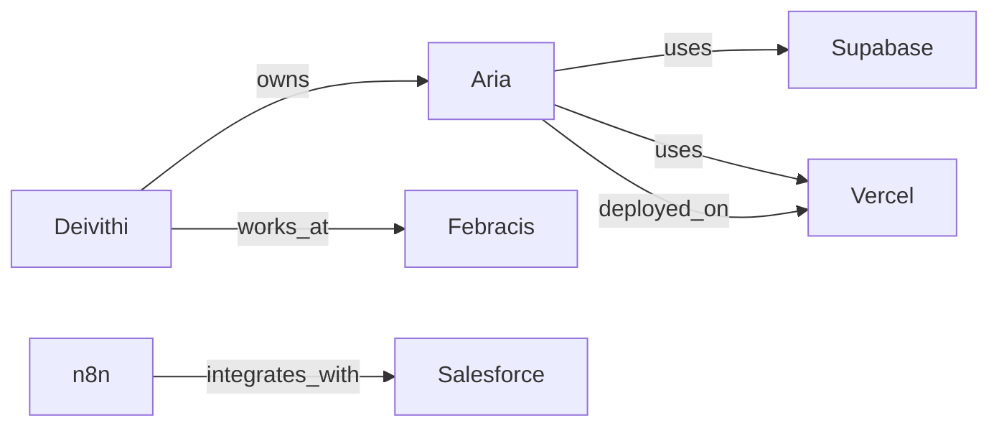

# 🕸️ Knowledge Graph — Memória Relacional

> **"Memória flat lembra fatos. Memória relacional lembra conexões."**

## File Structure
- `SKILL.md` — Schema, workflow e regras (comece aqui)
- `references/schema.md` — Schema completo de entity types e relation types
- `gotchas.md` — Problemas conhecidos

## Related Skills
- `mem` — Gerenciamento de memória flat-file (complementar: fatos vs relações)
- `web-research` — Pesquisa que alimenta o grafo com novos conhecimentos
- `recap` — Captura de sessão que atualiza o grafo automaticamente

---

## 1. Arquitetura — Dual Layer Memory

```
┌─────────────────────────────────────────┐
│  CAMADA 1: Flat Files (MEMORY.md)       │
│  → Fatos detalhados, documentos longos  │
│  → Frontmatter tipado (user/feedback/   │
│    project/reference)                   │
│  → Leitura por arquivo individual       │
└──────────────────┬──────────────────────┘
                   │ ponteiros
┌──────────────────▼──────────────────────┐
│  CAMADA 2: Knowledge Graph (Memory MCP) │
│  → Entidades (nós)                      │
│  → Relações (arestas)                   │
│  → Observations (atributos)             │
│  → Queries semânticas                   │
└─────────────────────────────────────────┘
```

**Regra de ouro:** Flat files guardam o **conteúdo detalhado**. Knowledge graph guarda as **conexões entre entidades**. Não duplicar — referenciar.

---

## 2. Entity Schema

| Entity Type | Descrição | Exemplos |
|-------------|-----------|----------|
| `person` | Pessoas envolvidas no trabalho | Deivithi, colegas Febracis |
| `project` | Projetos ativos ou concluídos | Aria, FIO-IA, Landing Page Eventos |
| `skill` | Skills do ecossistema Claude Code | web-research, code-review, minimax-pdf |
| `tool` | Ferramentas e MCPs | n8n, Supabase, Vercel, browser-use |
| `organization` | Empresas e equipes | Febracis, Anthropic |
| `concept` | Conceitos-chave e padrões | Integridade Conceitual, Ouroboros Loop |
| `workflow` | Workflows n8n e automações | PR Review Bot, Error Alerting |
| `platform` | Plataformas usadas | Salesforce, Google Workspace |
| `topic` | Tópico recorrente que agrega episódios (HyperMem) | auditoria-leads, deploy-vercel |
| `episode` | Segmento temático extraído de sessão (HyperMem) | 2026-04-11-ep1, 2026-04-08-ep3 |
| `group` | Hyperedge N-ária — agrupa 3+ entidades relacionadas | group-auditoria-leads |

---

## 3. Relation Types (Arestas)

| Relation | De → Para | Exemplo |
|----------|-----------|---------|
| `owns` | person → project | Deivithi → owns → Aria |
| `uses` | project → tool | Aria → uses → Supabase |
| `depends_on` | project → project | Landing Page → depends_on → Aria |
| `integrates_with` | tool → tool | n8n → integrates_with → Salesforce |
| `implements` | skill → concept | code-review → implements → Severity Scoring |
| `part_of` | skill → skill | n8n-code-javascript → part_of → n8n |
| `works_at` | person → organization | Deivithi → works_at → Febracis |
| `deployed_on` | project → platform | Aria → deployed_on → Vercel |
| `automates` | workflow → project | PR Review Bot → automates → code-review |
| `blocks` | project → project | [blocker] → blocks → [blocked] |
| `complements` | skill → skill | web-research → complements → iterative-retrieval |
| `belongs_to_topic` | episode → topic | 2026-04-11-ep1 → belongs_to_topic → auditoria-leads |
| `contains` | group → any | group-auditoria → contains → 2026-04-11-ep1 (obs: "weight: 0.9") |

---

## 4. Workflow — Manter o Grafo

### 4.1 Quando Adicionar Entidades

| Trigger | Ação |
|---------|------|
| Novo projeto mencionado pelo usuário | `create_entities` com type `project` |
| Nova skill criada | `create_entities` com type `skill` + relações |
| Nova tool/MCP conectada | `create_entities` com type `tool` |
| Nova pessoa referenciada | `create_entities` com type `person` |
| Novo workflow n8n criado | `create_entities` com type `workflow` |

### 4.2 Quando Adicionar Relações

| Trigger | Ação |
|---------|------|
| Skill referencia outra skill (Related Skills) | `create_relations` `complements` |
| Projeto usa uma tool | `create_relations` `uses` |
| Projeto depende de outro | `create_relations` `depends_on` |
| Workflow automatiza um processo | `create_relations` `automates` |
| Episódio criado via `/recap` | `create_relations` `belongs_to_topic` (episode → topic) |
| Grupo/hyperedge criado para N elementos | `create_relations` `contains` (group → cada membro) |

### 4.3 Quando Adicionar Observations

| Trigger | Ação |
|---------|------|
| Status de projeto muda | `add_observations` (ex: "MVP concluído 2026-03-15") |
| Decisão técnica tomada | `add_observations` (ex: "Escolheu Vercel em vez de Netlify") |
| Problema conhecido detectado | `add_observations` (ex: "OAuth2 instável com Google") |
| Importância de membro em grupo | `add_observations` no group (ex: "weight:episode/2026-04-11-ep1:0.9") |
| Fatos extraídos de episódio | `add_observations` no episode (ex: "fact: OAuth expira em 7d no modo Testing") |

---

## 5. Query Patterns

### "O que impacta o projeto X?"
```
1. search_nodes(query="X")
2. Encontrar entidades relacionadas (uses, depends_on, deployed_on)
3. Para cada relação, abrir nó conectado
4. Consolidar: tools, dependências, skills envolvidas
```

### "O que usa a tool Y?"
```
1. search_nodes(query="Y")
2. Encontrar todas as relações onde Y é destino (→ Y)
3. Listar projetos, workflows e skills que usam Y
```

### "Quais skills estão conectadas?"
```
1. search_nodes(query="skill")
2. Filtrar por entityType="skill"
3. Mapear relações complements/part_of entre elas
4. Gerar visualização (mermaid-diagrams)
```

### "Status geral do ecossistema"
```
1. read_graph() — grafo completo
2. Contar entidades por tipo
3. Identificar nós isolados (sem relações)
4. Gerar relatório de saúde do grafo
```

---

## 6. Sync Protocol — Flat Files ↔ Graph

### Ao criar memória flat-file:
1. Criar/atualizar entidade correspondente no graph
2. Adicionar observation com ponteiro: "flat_file: memory/nome_do_arquivo.md"

### Ao criar entidade no graph:
1. NÃO criar flat-file automaticamente (só se precisar de conteúdo detalhado)
2. Entidades leves vivem só no graph

### Ao deletar memória flat-file:
1. Remover observation com ponteiro do arquivo
2. NÃO deletar entidade (pode ter outras relações válidas)

---

## 7. Anti-Patterns

| Anti-Pattern | Por Que é Ruim | Fazer Isso |
|-------------|----------------|------------|
| Duplicar conteúdo no graph | Dessincroniza com flat files | Usar observations como ponteiros, não como cópias |
| Criar relação sem entidades | Graph quebrado | Sempre criar entidades primeiro |
| Relações genéricas ("related_to") | Sem semântica útil | Usar relation types específicos do schema |
| Graph gigante sem poda | Ruído > sinal | Máximo ~100 entidades ativas, arquivar inativas |
| Nunca consultar o graph | Desperdício | Consultar em: pesquisa, planejamento, auditoria |

---

## 8. Integração com Ecossistema

### Com `/recap`
Ao final de sessão, `/recap` PODE sugerir atualizações no graph:
- Novos projetos mencionados → criar entidades
- Novas conexões descobertas → criar relações
- Status mudou → adicionar observations

### Com `/mem`
O comando `/mem` busca em flat files. Para busca relacional, usar `search_nodes` diretamente.

### Visualização com `mermaid-diagrams`

