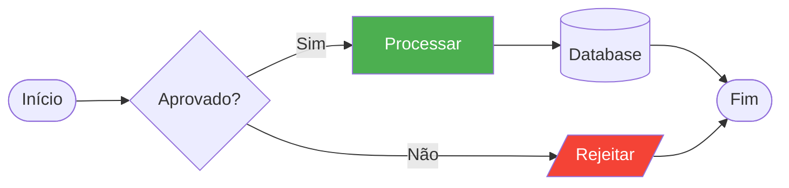
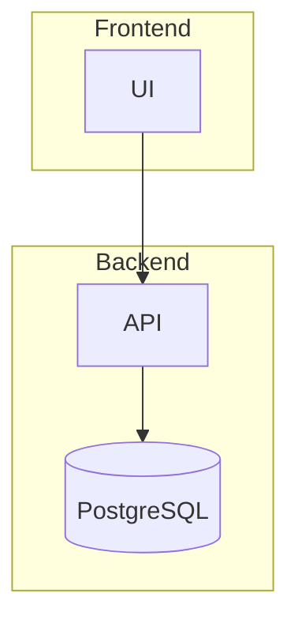
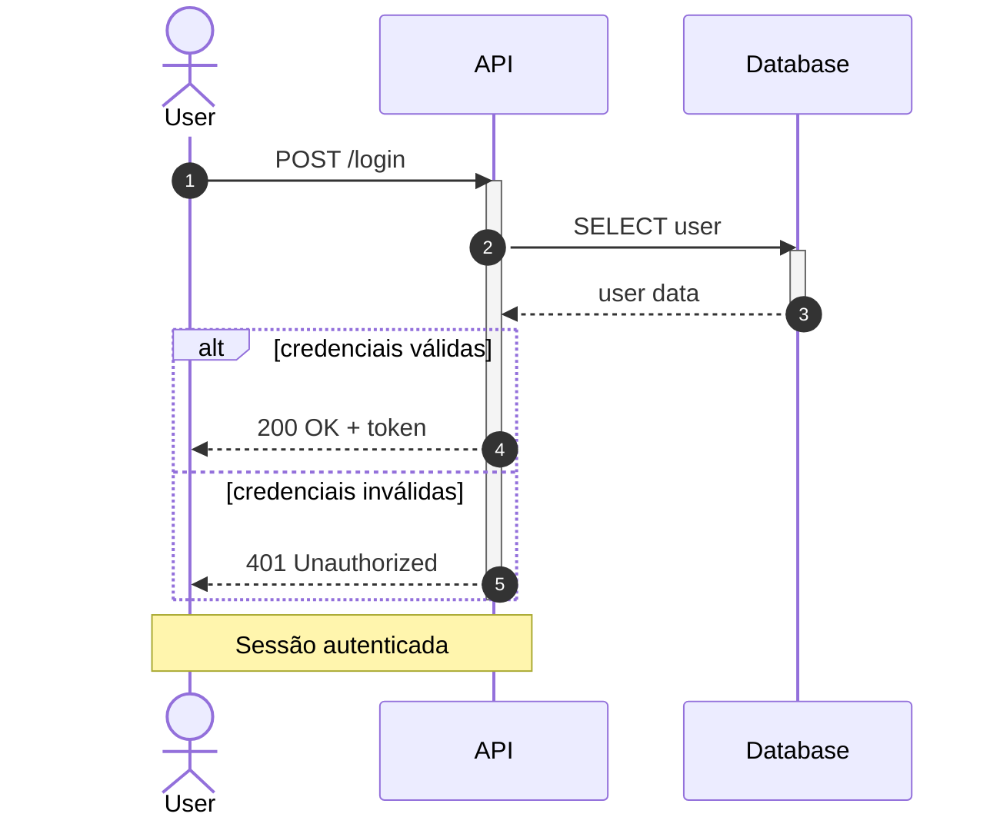
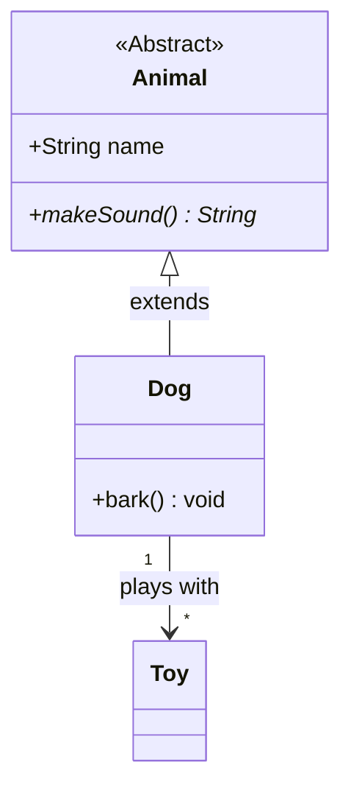
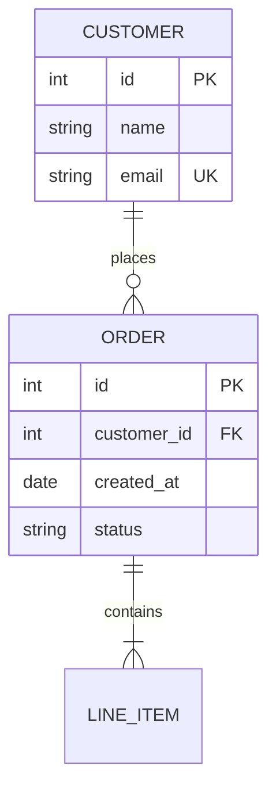
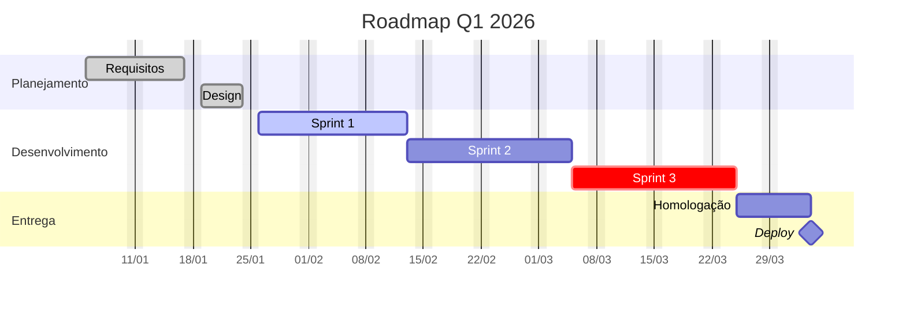
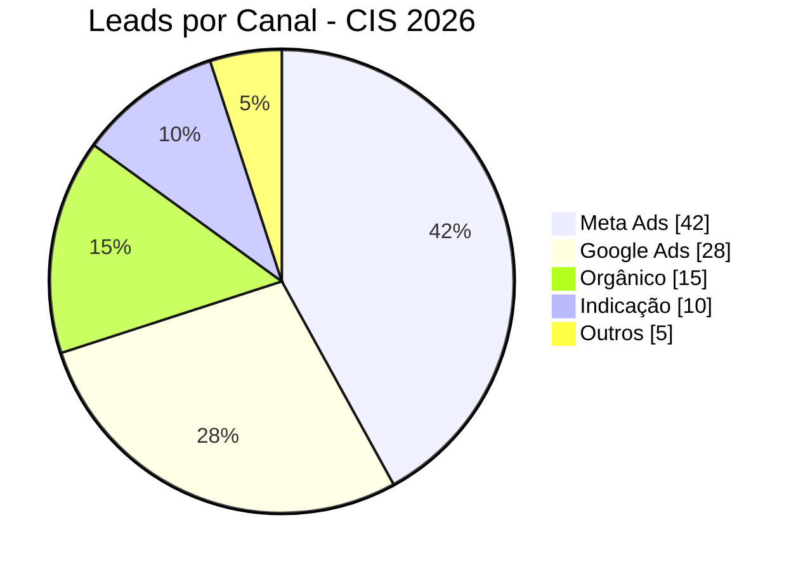
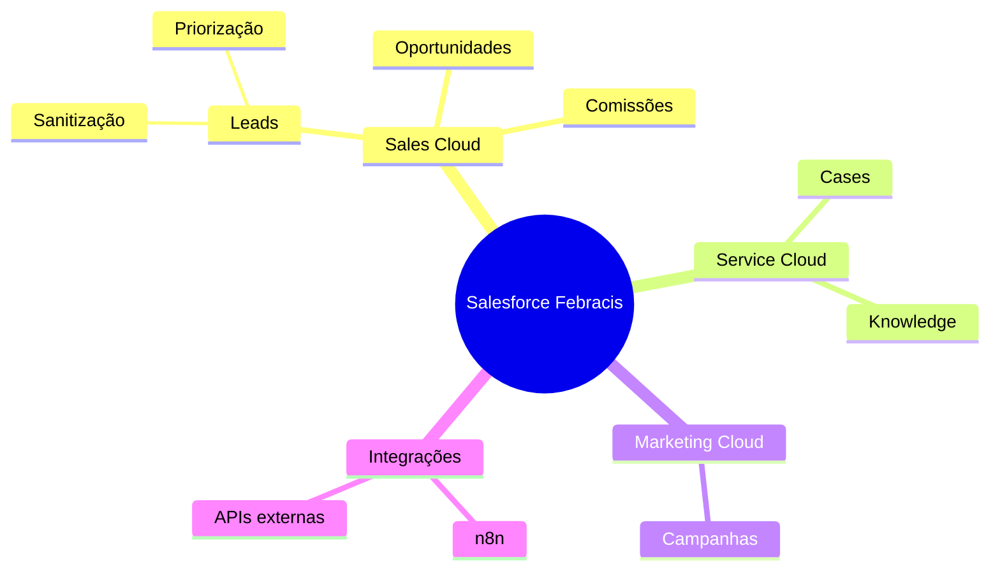
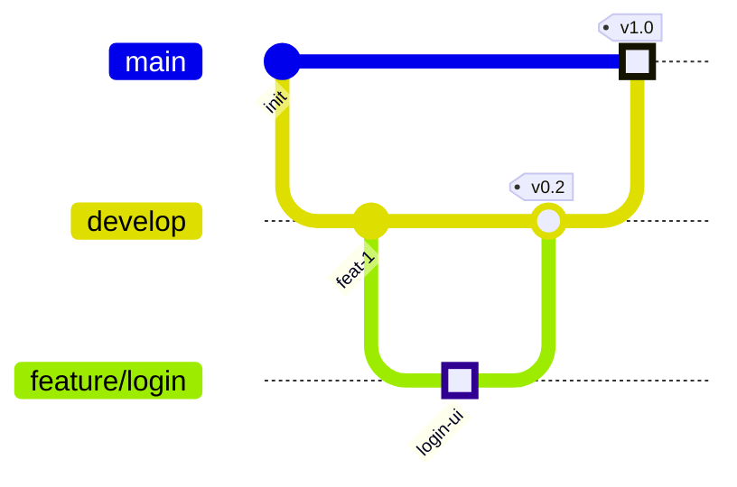
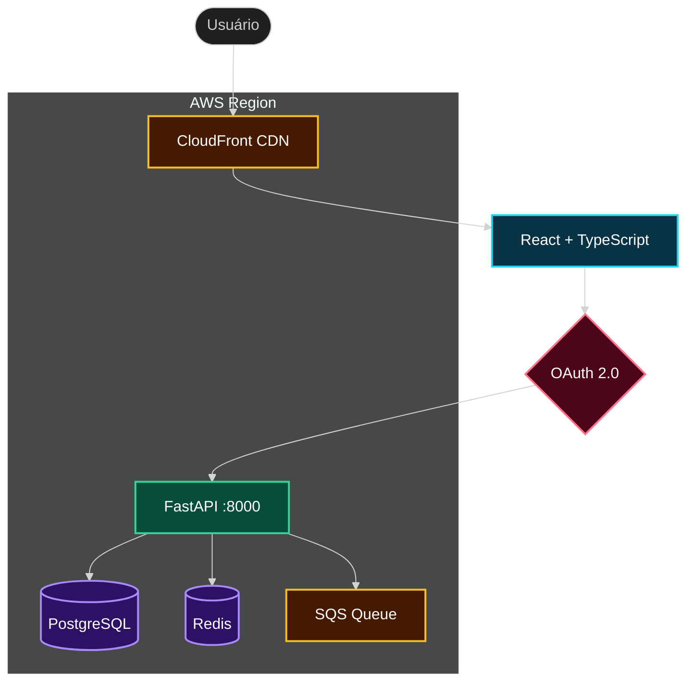

# 📊 Mermaid Diagrams — Diagramas via Texto

> **"Um diagrama vale mais que mil linhas de documentação."**
> Mermaid.js permite gerar diagramas complexos escrevendo apenas texto — perfeito para LLMs.

## 📁 File Structure
- `SKILL.md` — Você está aqui. Referência completa + exemplos.
- `gotchas.md` — ⚠️ Problemas conhecidos.

## 🔗 Related Skills
- `frontend-design` — Embede diagramas Mermaid em UIs web
- `data-charts` — Para gráficos de dados (bar, line, pie), use data-charts; para diagramas estruturais, use esta skill
- `code-review` — Gere diagramas de fluxo para documentar lógica revisada
- `markdown-slides` — Mermaid integra nativamente com Marp e Slidev

---

## 1. Renderização

### HTML (CDN)
```html
<!DOCTYPE html>
<html>
<head><meta charset="UTF-8"><title>Diagram</title></head>
<body>
  <pre class="mermaid">
    flowchart TD
      A --> B
  </pre>
  <script type="module">
    import mermaid from 'https://cdn.jsdelivr.net/npm/mermaid@11/dist/mermaid.esm.min.mjs';
    mermaid.initialize({ startOnLoad: true, theme: 'default' });
  </script>
</body>
</html>
```

### CLI (Export SVG/PNG)
```bash
npm install -g @mermaid-js/mermaid-cli
mmdc -i diagram.mmd -o output.svg
mmdc -i diagram.mmd -o output.png -t dark -b transparent -s 2
```

### Temas
5 built-in: `default`, `neutral`, `dark`, `forest`, `base`

Customizar com `base`:
```
%%{init: {'theme': 'base', 'themeVariables': {
  'primaryColor': '#BB2528',
  'primaryTextColor': '#fff',
  'lineColor': '#F8B229'
}}}%%
```

---

## 2. Tipos de Diagrama

### 2.1 Flowchart
**Declaração:** `flowchart TD` (TD, TB, BT, LR, RL)

**Formas de nós:**
| Forma | Sintaxe |
|-------|---------|
| Retângulo | `A[Texto]` |
| Arredondado | `A(Texto)` |
| Stadium | `A([Texto])` |
| Cilindro (DB) | `A[(Texto)]` |
| Círculo | `A((Texto))` |
| Losango | `A{Texto}` |
| Hexágono | `A{{Texto}}` |

**Links:**
| Tipo | Sintaxe |
|------|---------|
| Seta | `A --> B` |
| Com texto | `A -->|texto| B` |
| Pontilhado | `A -.-> B` |
| Grosso | `A ==> B` |

**Exemplo — Fluxo de aprovação:**


**Subgraphs:**


**Casos de uso:** Fluxos de processo, decision trees, arquitetura, pipelines CI/CD

---

### 2.2 Sequence Diagram
**Declaração:** `sequenceDiagram`

**Setas:**
| Tipo | Sintaxe | Uso |
|------|---------|-----|
| Síncrona | `->>` | Chamada |
| Resposta | `-->>` | Retorno |
| Falha | `-x` | Erro |
| Async | `-)` | Fire-and-forget |

**Blocos:** `alt`/`else`, `opt`, `loop`, `par`/`and`, `critical`, `break`, `rect`

**Exemplo — Login API:**


**Casos de uso:** Fluxos de API, autenticação, microserviços

---

### 2.3 Class Diagram
**Declaração:** `classDiagram`

**Visibilidade:** `+` público, `-` privado, `#` protegido, `~` package
**Classificadores:** `*` abstrato, `$` estático

**Relacionamentos:**
| Tipo | Sintaxe |
|------|---------|
| Herança | `<\|--` |
| Composição | `*--` |
| Agregação | `o--` |
| Dependência | `..>` |

**Exemplo:**


**Casos de uso:** Modelagem OO, domain model, UML

---

### 2.4 Entity Relationship Diagram
**Declaração:** `erDiagram`

**Cardinalidades:**
| Símbolo | Significado |
|---------|-------------|
| `\|\|` | Exatamente um |
| `\|o` / `o\|` | Zero ou um |
| `}\|` / `\|{` | Um ou mais |
| `}o` / `o{` | Zero ou mais |

**Atributos:** `PK`, `FK`, `UK`

**Exemplo — Schema de leads:**


**Casos de uso:** Modelagem de banco, schema Salesforce, design de entidades

---

### 2.5 Gantt Chart
**Declaração:** `gantt`

**Tags:** `done`, `active`, `crit`, `milestone`

**Exemplo — Roadmap:**


**Casos de uso:** Planejamento de projeto, timelines, roadmaps

---

### 2.6 Pie Chart
**Declaração:** `pie`

**Exemplo:**


**Casos de uso:** Distribuição percentual, composição de receita

---

### 2.7 Mindmap
**Declaração:** `mindmap` (hierarquia por indentação)

**Formas:** default, `[quadrado]`, `(arredondado)`, `((círculo))`, `)cloud(`, `{{hexágono}}`

**Exemplo:**


**Casos de uso:** Brainstorming, escopo, taxonomias

---

### 2.8 Git Graph
**Declaração:** `gitGraph`

**Comandos:** `commit`, `branch`, `checkout`/`switch`, `merge`, `cherry-pick`
**Commit types:** `NORMAL`, `REVERSE`, `HIGHLIGHT`

**Exemplo:**


**Casos de uso:** Git flow, branching strategy, changelogs

---

## 3. Outros Diagramas Suportados

| Tipo | Declaração | Uso |
|------|-----------|-----|
| State Machine | `stateDiagram-v2` | Máquinas de estado |
| User Journey | `journey` | Experiência do usuário |
| Quadrant | `quadrantChart` | Matriz 2x2 (Eisenhower) |
| Timeline | `timeline` | Linha do tempo |
| C4 Architecture | `C4Context` | Diagramas C4 |
| Sankey | `sankey-beta` | Fluxos de valor |
| XY Chart | `xychart-beta` | Gráficos de linha/barra |
| Kanban | `kanban` | Board kanban |
| Radar | `radar-beta` | Gráfico radar/spider |

---

## 4. Quick Reference

```
flowchart TD/LR    → Fluxos, processos, arquitetura
sequenceDiagram    → Chamadas API, integrações
classDiagram       → Modelagem OO, domain model
erDiagram          → Schema de banco, entidades
gantt              → Timelines, roadmaps
pie                → Distribuição, percentuais
mindmap            → Brainstorm, taxonomia
gitGraph           → Git flow, branching
```

---

## 5. Workflow de Geração

1. **Identificar tipo:** Que informação o diagrama precisa mostrar?
2. **Selecionar diagrama:** Usar Quick Reference acima
3. **Gerar código Mermaid:** Escrever usando a sintaxe do tipo
4. **Embeder em HTML:** Usar template CDN da Seção 1 (ou template dark da Seção 7 para diagramas de arquitetura)
5. **Salvar:** Como `.html` (interativo) ou exportar via `mmdc` (SVG/PNG)

> **Regra:** Sempre gerar o HTML completo com o CDN do Mermaid para que o usuário possa abrir no browser e ver o diagrama imediatamente.

---

## 6. Preset de Cores Semânticas — Arquitetura

> Paleta profissional para diagramas de arquitetura de sistemas. Cada tipo de componente tem cor consistente.
> Fonte: Cocoon-AI/architecture-diagram-generator (1.6K⭐, MIT).

### Paleta

| Tipo | Stroke | Uso |
|------|--------|-----|
| **Frontend** | `#22d3ee` cyan | UI, React, browser, mobile |
| **Backend** | `#34d399` emerald | API, servidores, workers |
| **Database** | `#a78bfa` violet | PostgreSQL, Redis, MongoDB |
| **Cloud** | `#fbbf24` amber | AWS, GCP, Cloudflare, Vercel |
| **Security** | `#fb7185` rose | Auth, firewall, WAF, OAuth |
| **Message Bus** | `#fb923c` orange | Queues, Kafka, PubSub, webhooks |
| **External** | `#94a3b8` slate | APIs de terceiros, serviços externos |

### classDef — Copiar e colar no flowchart

```mermaid
%%{init: {'theme': 'dark'}}%%
flowchart TD
  classDef frontend fill:#083344,stroke:#22d3ee,stroke-width:2px,color:#fff
  classDef backend fill:#064e3b,stroke:#34d399,stroke-width:2px,color:#fff
  classDef database fill:#2e1065,stroke:#a78bfa,stroke-width:2px,color:#fff
  classDef cloud fill:#451a03,stroke:#fbbf24,stroke-width:2px,color:#fff
  classDef security fill:#4c0519,stroke:#fb7185,stroke-width:2px,color:#fff
  classDef msgbus fill:#431407,stroke:#fb923c,stroke-width:2px,color:#fff
  classDef external fill:#1e293b,stroke:#94a3b8,stroke-width:2px,color:#fff
```

### Exemplo — Stack completo



**Regra de uso:** Quando o diagrama representar arquitetura de sistema, **sempre** aplicar o preset semântico acima. Para diagramas genéricos (fluxos de processo, decision trees), o estilo padrão do Mermaid é suficiente.

---

## 7. Template HTML Dark — Arquitetura

> Template alternativo para diagramas de arquitetura com estética profissional.
> Usar no lugar do template básico (Seção 1) quando o diagrama for de infraestrutura ou arquitetura de sistema.

```html
<!DOCTYPE html>
<html lang="pt-BR">
<head>
  <meta charset="UTF-8">
  <meta name="viewport" content="width=device-width, initial-scale=1.0">
  <title>TITULO — Architecture Diagram</title>
  <style>
    * { margin: 0; padding: 0; box-sizing: border-box; }

    body {
      font-family: 'JetBrains Mono', ui-monospace, 'Cascadia Code', 'Fira Code', monospace;
      background: #020617;
      min-height: 100vh;
      padding: 2rem;
      color: white;
    }

    .container { max-width: 1200px; margin: 0 auto; }

    .header { margin-bottom: 2rem; }
    .header-row { display: flex; align-items: center; gap: 1rem; margin-bottom: 0.5rem; }

    .pulse-dot {
      width: 12px; height: 12px;
      background: #22d3ee; border-radius: 50%;
      animation: pulse 2s infinite;
    }
    @keyframes pulse { 0%,100% { opacity: 1; } 50% { opacity: 0.5; } }

    h1 { font-size: 1.5rem; font-weight: 700; letter-spacing: -0.025em; }
    .subtitle { color: #94a3b8; font-size: 0.875rem; margin-left: 1.75rem; }

    .diagram-container {
      background: rgba(15, 23, 42, 0.5);
      border-radius: 1rem;
      border: 1px solid #1e293b;
      padding: 1.5rem;
      overflow-x: auto;
    }

    .cards {
      display: grid;
      grid-template-columns: repeat(auto-fit, minmax(280px, 1fr));
      gap: 1rem; margin-top: 2rem;
    }
    .card {
      background: rgba(15, 23, 42, 0.5);
      border-radius: 0.75rem;
      border: 1px solid #1e293b;
      padding: 1.25rem;
    }
    .card-header { display: flex; align-items: center; gap: 0.5rem; margin-bottom: 0.75rem; }
    .card-dot { width: 8px; height: 8px; border-radius: 50%; }
    .card-dot.cyan    { background: #22d3ee; }
    .card-dot.emerald { background: #34d399; }
    .card-dot.violet  { background: #a78bfa; }
    .card-dot.amber   { background: #fbbf24; }
    .card-dot.rose    { background: #fb7185; }
    .card h3 { font-size: 0.875rem; font-weight: 600; }
    .card ul { list-style: none; color: #94a3b8; font-size: 0.75rem; }
    .card li { margin-bottom: 0.375rem; }

    .footer { text-align: center; margin-top: 1.5rem; color: #475569; font-size: 0.75rem; }
  </style>
</head>
<body>
  <div class="container">
    <!-- Header -->
    <div class="header">
      <div class="header-row">
        <div class="pulse-dot"></div>
        <h1>TITULO Architecture</h1>
      </div>
      <p class="subtitle">DESCRICAO</p>
    </div>

    <!-- Diagrama Mermaid — pre DEVE começar na coluna 0 (sem indentação) -->
    <div class="diagram-container">
<pre class="mermaid">
%%{init: {'theme': 'dark'}}%%
flowchart TD
  classDef frontend fill:#083344,stroke:#22d3ee,stroke-width:2px,color:#fff
  classDef backend fill:#064e3b,stroke:#34d399,stroke-width:2px,color:#fff
  classDef database fill:#2e1065,stroke:#a78bfa,stroke-width:2px,color:#fff
  classDef cloud fill:#451a03,stroke:#fbbf24,stroke-width:2px,color:#fff
  classDef security fill:#4c0519,stroke:#fb7185,stroke-width:2px,color:#fff
  classDef msgbus fill:#431407,stroke:#fb923c,stroke-width:2px,color:#fff
  classDef external fill:#1e293b,stroke:#94a3b8,stroke-width:2px,color:#fff

  MERMAID_NODES_AQUI
</pre>
    </div>

    <!-- Cards (opcional — preencher conforme o diagrama) -->
    <div class="cards">
      <div class="card">
        <div class="card-header">
          <div class="card-dot cyan"></div>
          <h3>Frontend</h3>
        </div>
        <ul>
          <li>• Item 1</li>
          <li>• Item 2</li>
        </ul>
      </div>
      <div class="card">
        <div class="card-header">
          <div class="card-dot emerald"></div>
          <h3>Backend</h3>
        </div>
        <ul>
          <li>• Item 1</li>
          <li>• Item 2</li>
        </ul>
      </div>
      <div class="card">
        <div class="card-header">
          <div class="card-dot violet"></div>
          <h3>Data</h3>
        </div>
        <ul>
          <li>• Item 1</li>
          <li>• Item 2</li>
        </ul>
      </div>
    </div>

    <p class="footer">TITULO • Gerado em DATA</p>
  </div>

  <script type="module">
    import mermaid from 'https://cdn.jsdelivr.net/npm/mermaid@11/dist/mermaid.esm.min.mjs';
    mermaid.initialize({
      startOnLoad: true,
      theme: 'dark',
      themeVariables: {
        primaryColor: '#1e293b',
        primaryTextColor: '#e2e8f0',
        primaryBorderColor: '#334155',
        lineColor: '#64748b',
        secondaryColor: '#0f172a',
        tertiaryColor: '#020617',
        background: '#020617',
        mainBkg: '#0f172a',
        nodeBorder: '#334155',
        clusterBkg: 'rgba(15,23,42,0.5)',
        clusterBorder: '#1e293b',
        titleColor: '#e2e8f0',
        edgeLabelBackground: '#0f172a'
      },
      flowchart: { curve: 'basis', padding: 20 }
    });
  </script>
</body>
</html>
```

### Quando usar cada template

| Cenário | Template |
|---------|----------|
| Diagrama genérico (fluxo, ER, gantt, etc.) | **Básico** (Seção 1) |
| Arquitetura de sistema, infra, cloud | **Dark** (Seção 7) |
| Export para documentação (GitHub, Obsidian) | Código Mermaid puro (sem HTML) |
