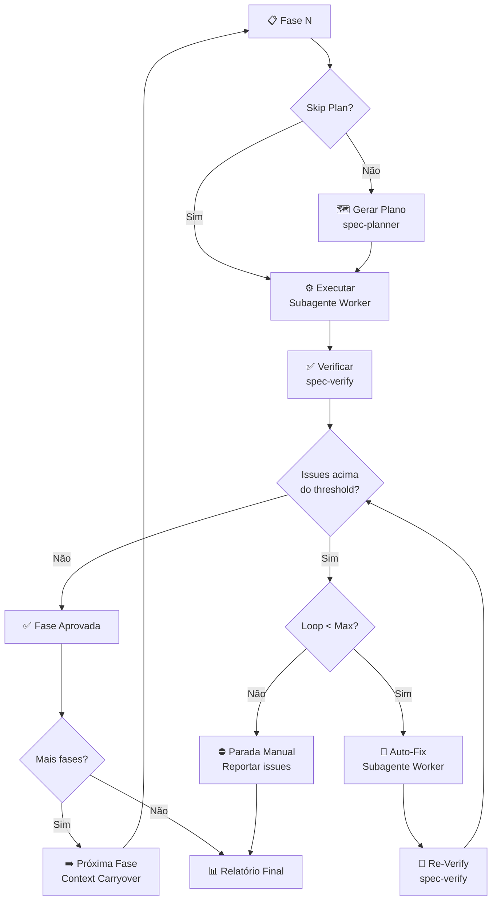

# ⚡ Spec YOLO — Automação Total Plan → Code → Verify

> **"YOLO Mode automates workflows end-to-end, minimizing manual intervention. Plan, code, verify, fix-forward — all autonomous."**
> — Inspirado no Traycer.ai YOLO Mode

## 📁 File Structure
- `SKILL.md` — Você está aqui. Protocolo completo.
- `gotchas.md` — Problemas conhecidos. Consulte quando algo falhar.

## 🔗 Related Skills
- `spec-planner` — Gera planos (Step 1 do loop)
- `spec-verify` — Verifica implementação (Step 3 do loop)
- `spec-phases` — Decomposição em fases (input para YOLO)
- `spec-epic` — Pipeline completo (YOLO executa os tickets)
- `alpha-loop` — Pattern de iteração test-fix-retest
- `agent-harness` — Progress tracking e checkpoints

---

## 🧠 Insight Central

> **YOLO = confiança no processo, não negligência.**
> O loop é: Plan → Code → Verify → Fix → Re-verify.
> Automação total, mas com **guardrails**: max 3 loops, severity thresholds,
> parada automática em falha não-resolvível.

---

## 1. Configuração

Antes de iniciar, definir:

```markdown
## YOLO Config

| Parâmetro | Valor | Descrição |
|-----------|-------|-----------|
| **Skip Plan** | false | Pular geração de plano? (para tasks simples) |
| **Severity Threshold** | MAJOR | Nível mínimo para auto-fix (CRITICAL/MAJOR/MINOR) |
| **Max Fix Loops** | 3 | Máximo de loops de correção por fase |
| **Auto-commit** | false | Commitar automaticamente após verificação aprovada? |
| **Progress Tracking** | true | Usar agent-harness para checkpoints? |
```

**Defaults recomendados:** Skip Plan=false, Threshold=MAJOR, Loops=3, Auto-commit=false.

---

## 2. Loop Principal — Por Fase



---

## 3. Steps Detalhados

### Step 1: 🗺️ Gerar Plano (se Skip Plan = false)

- Usar `spec-planner` para gerar plano da fase atual
- **Não pedir aprovação** — YOLO mode é autônomo
- Registrar plano gerado no tracking

### Step 2: ⚙️ Executar

- Spawnar **subagente worker** com:
  - Plano da fase (ou query direta se Skip Plan)
  - Contexto carryover da fase anterior (se houver)
  - AGENTS.md / CLAUDE.md do projeto
- Worker implementa o plano step-by-step
- Registrar arquivos modificados

### Step 3: ✅ Verificar

- Usar `spec-verify` com:
  - Plano como referência
  - Diff gerado pela execução
- Gerar relatório com scorecard

### Step 4: 🔧 Auto-Fix (se necessário)

- Filtrar issues pelo severity threshold
- Ordenar: Critical → Major → Minor
- Para cada issue:
  1. Spawnar subagente worker com contexto do fix
  2. Aplicar correção
  3. Registrar fix no tracking

### Step 5: 🔄 Re-Verify

- Usar `spec-verify` modo incremental (foco nos fixes)
- Se ainda há issues acima do threshold:
  - Incrementar loop counter
  - Se < Max loops → voltar ao Step 4
  - Se >= Max loops → **PARAR** e reportar

### Step 6: ➡️ Próxima Fase

- Gerar context carryover:
  - Status da fase concluída
  - Issues resolvidos e pendentes
  - Aprendizados
  - Ajustes no plano geral
- Avançar para próxima fase

---

## 4. Tracking de Execuções

Manter log completo:

```markdown
# 📊 YOLO Execution Log

## Sessão: [timestamp BRT]
## Config: Skip Plan=false, Threshold=MAJOR, Max Loops=3

### Fase 1: [Nome]
- **Status:** ✅ Aprovada (1 loop)
- **Plano:** [resumo em 1 linha]
- **Arquivos:** [lista]
- **Issues encontradas:** 0C 1M 2m
- **Issues resolvidas:** 1M 2m
- **Commits:** [hash se auto-commit]

### Fase 2: [Nome]
- **Status:** ⚠️ Aprovada com ressalvas (2 loops)
- **Issues pendentes:** 1 MINOR (acknowledged)
...

### Fase N: [Nome]
- **Status:** ⛔ Parada manual (3 loops, 1 CRITICAL restante)
- **Issue não resolvida:** [descrição]
...

## Resumo Final
| Fase | Status | Loops | Issues |
|------|--------|-------|--------|
| 1 | ✅ | 1 | 0C 0M |
| 2 | ⚠️ | 2 | 0C 0M 1m |
| 3 | ⛔ | 3 | 1C restante |

## Total
- Fases concluídas: 2/3
- Issues resolvidas: 5
- Issues pendentes: 1 CRITICAL
- Próxima ação: [intervenção manual necessária]
```

---

## 5. Modos de YOLO

### 5.1 YOLO Plan (Default)
Plan → Code → Verify → Fix → Next.
**Melhor para:** Tasks complexas que precisam de plano.

### 5.2 YOLO Direct
Code → Verify → Fix → Next. (Skip Plan = true)
**Melhor para:** Tasks simples e bem definidas, bugs conhecidos.

### 5.3 YOLO Review
Review → Fix → Re-review → Next.
**Melhor para:** Batch de code review com auto-fix.

---

## 6. Regras de Segurança

| Regra | Descrição |
|-------|-----------|
| **Max 3 loops** | Evita loop infinito de fix-break-fix |
| **Parada em CRITICAL** | Se CRITICAL persiste após 3 loops → parada obrigatória |
| **Sem auto-commit default** | Commitar só com aprovação explícita |
| **Checkpoint por fase** | Se sessão crashar, pode retomar da última fase completa |
| **Progress visível** | Tracking atualizado em tempo real |

---

## 7. Progressive Disclosure

| Escopo | Comportamento |
|--------|---------------|
| **1 fase** | YOLO inline, sem tracking formal |
| **2-4 fases** | YOLO com tracking, sem checkpoints |
| **5+ fases** | YOLO com tracking + agent-harness + checkpoints |

---

## 8. Handoff Points

| Quando | Repassar para | Condição |
|--------|--------------|----------|
| Step 1 — gerar plano da fase | `spec-planner` | Plano file-level com acceptance criteria |
| Step 3 — verificar implementação | `spec-verify` | Validar contra spec antes de prosseguir |
| Auto-fix loop iterativo | `alpha-loop` | Test→fix→retest (max 5 iterações) |
| CRITICAL persiste após 3 loops | `code-review` | Parada obrigatória — escalar para review humano |
| 5+ fases com sessão longa | `agent-harness` | Checkpoints automáticos para recovery |

---

## 9. Gotchas

⚠️ Consulte `gotchas.md` para problemas conhecidos.
