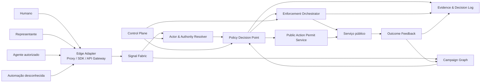
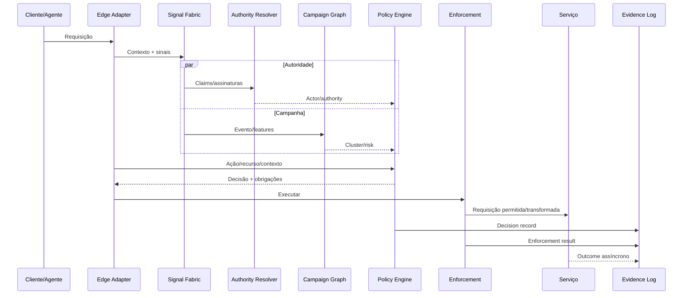
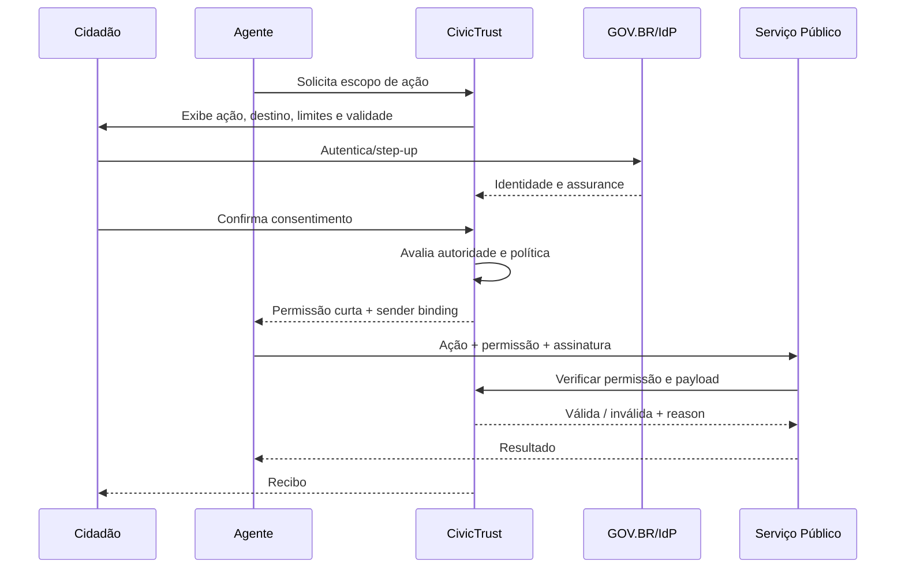

# Especificação Técnica — CivicTrust Public Action Gateway

**Versão:** 0.1  
**Data:** 22 de setembro de 2026  
**Status:** arquitetura de referência para PoC e threat modeling

---

## 1. Objetivo

Definir uma arquitetura inicial para avaliar, autorizar, controlar e auditar ações em serviços públicos digitais, integrando sinais de segurança, identidade, delegação, política e resultados.

---

## 2. Arquitetura lógica



---

## 3. Princípios arquiteturais

1. **Data plane separado do control plane.**
2. **PII separada de telemetria.**
3. **Decisioning determinístico e versionado.**
4. **Modelos produzem sinais; política produz decisão.**
5. **Open standards first.**
6. **Sem LLM no hot path obrigatório.**
7. **Fail mode definido por ação.**
8. **Data minimization by design.**
9. **Multi-tenant lógico; opção single-tenant física.**
10. **Todos os conectores são substituíveis.**

---

## 4. Componentes

### 4.1 Edge Adapter

Funções:

- gerar correlation ID;
- extrair metadados;
- aplicar decisão;
- cachear políticas seguras;
- validar permissão;
- operar fail mode;
- emitir telemetria.

Formas:

- reverse proxy;
- Envoy filter;
- NGINX module;
- API Gateway plugin;
- SDK;
- sidecar;
- log-only collector.

### 4.2 Signal Fabric

Normaliza sinais em um schema comum.

Fontes:

- HTTP;
- TLS/network;
- WAF;
- bot manager;
- device intelligence;
- sessão;
- conta;
- GOV.BR/IdP;
- Web Bot Auth;
- PACT/Privacy Pass;
- passkey;
- transaction outcome.

### 4.3 Actor & Authority Resolver

Produz:

```json
{
  "actor_class": "AGENT_AUTHORIZED",
  "actor_id": "pseudonymous-id",
  "operator_id": "agent-operator",
  "principal_id": "citizen-pseudonymous-id",
  "authority_status": "VALID",
  "authority_source": "GOVBR_OIDC",
  "assurance": {
    "identity_level": "GOLD",
    "authentication_methods": ["pwd", "otp"],
    "verified_at": "2026-09-22T14:00:00-03:00"
  },
  "allowed_actions": ["schedule.search", "schedule.reserve"],
  "expires_at": "2026-09-29T14:00:00-03:00"
}
```

### 4.4 Campaign Graph

Nós:

- evento;
- sessão;
- ator pseudônimo;
- conta;
- dispositivo;
- rede;
- credential ID;
- payload digest;
- recurso;
- serviço;
- permissão;
- outcome.

Arestas:

- originou;
- reutilizou;
- compartilhou;
- reservou;
- cancelou;
- representa;
- autorizado_por;
- semelhante_a;
- pertence_ao_cluster.

Tecnologia inicial:

- banco relacional + materialized views;
- feature store;
- clustering offline/near-real-time.

Grafo dedicado somente quando volume e consultas justificarem.

### 4.5 Policy Decision Point

Entradas:

- contexto da requisição;
- ator;
- autoridade;
- campanha;
- serviço;
- recurso;
- política;
- risco;
- histórico.

Saída:

- disposition;
- reason codes;
- obligations;
- evidence references;
- TTL;
- policy version.

### 4.6 Enforcement Orchestrator

Executores:

- allow;
- throttle;
- external queue;
- step-up;
- permit issuance;
- quarantine;
- manual review;
- deny;
- notification.

### 4.7 Public Action Permit Service

Responsável por:

- emissão;
- validação;
- sender binding;
- one-time use;
- revogação;
- recibo;
- auditoria.

### 4.8 Evidence Log

Características:

- append-only;
- evento assinado;
- hash chain;
- carimbo de tempo;
- WORM para evidência crítica;
- versionamento;
- exportação redigida;
- segregação por tenant.

Blockchain não é requisito.

### 4.9 Control Plane

- tenant;
- catálogo de serviços;
- policy studio;
- approvals;
- conectores;
- modelo/feature registry;
- threat lab;
- simulation;
- governance;
- billing;
- deployment management.

---

## 5. Fluxo de avaliação



---

## 6. Fluxo da Permissão de Ação Pública



---

## 7. API

### 7.1 Avaliação

`POST /v1/evaluations`

#### Request

```json
{
  "tenant_id": "secretaria-x",
  "service_id": "document-appointment",
  "action": "appointment.reserve",
  "resource": {
    "type": "slot",
    "id": "2026-10-04T10:00:00-03:00|unit-17"
  },
  "request": {
    "method": "POST",
    "path": "/appointments",
    "ip": "tokenized",
    "user_agent": "normalized",
    "session_id": "opaque-session",
    "payload_digest": "sha256:..."
  },
  "identity_context": {
    "provider": "govbr",
    "subject": "pseudonymous-sub",
    "assurance": "gold",
    "amr": ["pwd", "otp"]
  },
  "agent_context": {
    "signed": true,
    "agent_id": "agent.example",
    "operator": "operator.example"
  },
  "vendor_signals": [
    {
      "provider": "waf-x",
      "signal": "bot_score",
      "value": 41
    }
  ]
}
```

#### Response

```json
{
  "decision_id": "dec_01J...",
  "disposition": "STEP_UP",
  "actor_class": "AGENT_IDENTIFIED",
  "authority_status": "INSUFFICIENT",
  "risk_band": "MEDIUM",
  "reason_codes": [
    "AGENT_SIGNATURE_VALID",
    "AUTHORITY_MISSING",
    "RESOURCE_SCARCE"
  ],
  "obligations": [
    {
      "type": "OBTAIN_ACTION_PERMIT",
      "scope": "appointment.reserve"
    }
  ],
  "policy_version": "svc-document-appointment@17",
  "expires_at": "2026-09-22T17:00:30Z",
  "evidence_ref": "evd_01J..."
}
```

### 7.2 Emitir permissão

`POST /v1/action-permits`

### 7.3 Verificar permissão

`POST /v1/action-permits/<built-in function id>/verify`

### 7.4 Revogar

`POST /v1/action-permits/<built-in function id>/revoke`

### 7.5 Eventos

`POST /v1/events`

### 7.6 Outcomes

`POST /v1/outcomes`

### 7.7 Recursos

`POST /v1/appeals`

### 7.8 Simulação

`POST /v1/policies/simulate`

---

## 8. Schema da Permissão de Ação Pública

Formato final sujeito a threat modeling.

Hipótese inicial:

- JWT/JWS interoperável;
- sender-constrained via DPoP ou mTLS;
- claims alinhadas a RAR;
- `jti` one-time;
- curta duração;
- payload digest;
- chave protegida em KMS/HSM.

### Claims

```json
{
  "iss": "https://issuer.civictrust.example",
  "sub": "pseudonymous-principal",
  "aud": "public-service-api",
  "iat": 178...,
  "exp": 178...,
  "jti": "pap_01J...",
  "actor": {
    "type": "ai_agent",
    "id": "agent.example",
    "operator": "operator.example"
  },
  "authorization_details": [
    {
      "type": "public_action",
      "service": "document-appointment",
      "actions": ["appointment.reserve"],
      "resource": {
        "unit": "unit-17",
        "city": "fortaleza"
      },
      "constraints": {
        "max_uses": 1,
        "max_attempts": 10,
        "cannot_cancel_existing": true,
        "valid_until": "2026-09-29T17:00:00Z"
      },
      "payload_digest": "sha256:..."
    }
  ],
  "assurance_context": {
    "identity_provider": "govbr",
    "level": "gold",
    "amr": ["pwd", "otp"]
  },
  "policy_version": "svc-document-appointment@17",
  "consent_evidence": "cev_01J...",
  "cnf": {
    "jkt": "thumbprint..."
  }
}
```

### Invariantes

1. Escopo nunca aumenta após emissão.
2. Ação do receptor deve ser subconjunto da permissão.
3. Payload divergente falha.
4. `jti` usado falha.
5. Receptor divergente falha.
6. Sender binding divergente falha.
7. Expirada/revogada falha.
8. Falha gera reason code.
9. A verificação não depende de LLM.
10. Evidência preserva somente o necessário.

---

## 9. Política

### DSL conceitual

```yaml
service: document-appointment
action: appointment.reserve
version: 17

authority:
  require:
    any:
      - citizen_authenticated
      - valid_human_representative
      - authorized_agent_with_action_permit

allocation:
  max_active_reservations_per_entitlement: 1
  max_attempts_per_day: 10
  prevent_duplicate_resource_capture: true

risk:
  when:
    - condition: campaign.coordination == high
      disposition: STEP_UP
    - condition: replay.detected == true
      disposition: DENY
    - condition: agent.identified == true and action_permit.valid != true
      disposition: STEP_UP

fairness:
  prohibited_features:
    - race
    - religion
    - political_opinion
    - disability
  denial_requires_appeal_token: true
  critical_decision_requires_human_review: true

resilience:
  fail_mode:
    read: ALLOW_MONITORED
    reserve: EXTERNAL_QUEUE
    mutate_identity: DENY_WITH_ALTERNATIVE_CHANNEL
```

### Reason codes iniciais

- `AUTHORITY_VALID`
- `AUTHORITY_MISSING`
- `AUTHORITY_EXPIRED`
- `AUTHORITY_REVOKED`
- `AUTHORITY_SCOPE_MISMATCH`
- `AGENT_SIGNATURE_VALID`
- `AGENT_SIGNATURE_INVALID`
- `ACTION_PERMIT_VALID`
- `PERMIT_SCOPE_MISMATCH`
- `PERMIT_PAYLOAD_MISMATCH`
- `PERMIT_REPLAY_DETECTED`
- `PERMIT_EXPIRED`
- `CAMPAIGN_COORDINATED`
- `RATE_THRESHOLD_EXCEEDED`
- `RESOURCE_SCARCE`
- `ENTITLEMENT_LIMIT_EXCEEDED`
- `IDENTITY_ASSURANCE_INSUFFICIENT`
- `MANUAL_REVIEW_REQUIRED`
- `POLICY_DEGRADED_MODE`

---

## 10. Dados

### 10.1 Entidades

- Tenant
- Service
- Action
- Resource
- Policy
- PolicyVersion
- Actor
- Principal
- AuthorityAssertion
- Agent
- Session
- Event
- Feature
- Cluster
- Decision
- Obligation
- EnforcementResult
- ActionPermit
- EvidencePack
- Appeal
- Outcome
- Connector

### 10.2 Separação

#### PII Vault

- identificadores civis;
- contatos;
- dados de cadastro;
- mapeamentos reversíveis.

#### Trust Data

- pseudonymous IDs;
- features;
- decisions;
- clusters;
- reason codes;
- policy versions.

#### Evidence Store

- dados necessários à auditoria;
- acesso restrito;
- retenção legal;
- WORM.

### 10.3 Pseudonimização

- chave por tenant;
- identificador por serviço quando possível;
- HMAC com chave protegida;
- rotação;
- prevenção de correlação global;
- reidentificação somente por fluxo autorizado.

### 10.4 Retenção

Definir por classe:

- sinal bruto: curto;
- feature: médio;
- decisão: conforme auditoria;
- evidência crítica: conforme obrigação;
- PII: mínimo;
- modelo agregado: sem reversão.

Nenhum prazo deve ser fixado antes do parecer jurídico e da finalidade de cada serviço.

---

## 11. Modelos e analytics

### Primeira versão

- regras;
- vendor scores;
- estatística;
- rate analysis;
- similaridade de payload;
- clustering temporal;
- graph features;
- anomaly detection.

### Não usar inicialmente

- LLM por requisição;
- classificação treinada sem labels;
- biometria comportamental invasiva;
- fingerprint proprietário não auditável.

### MLOps

- feature registry;
- dataset version;
- label provenance;
- offline evaluation;
- shadow deployment;
- champion/challenger;
- drift;
- rollback;
- fairness/accessibility testing;
- explanation mapping.

---

## 12. Threat model

| Ameaça | Exemplo | Controle |
|---|---|---|
| Bot de alto volume | milhares de reservas | rate, WAF signal, graph, policy |
| Automação stealth | navegador real | session/sequence/outcome |
| Proxy residencial | IPs distribuídos | graph, entitlement, payload |
| Fazenda humana | desafios resolvidos | limite por autoridade/recurso |
| Account takeover | conta válida roubada | assurance, behavior, step-up |
| Agente comprometido | prompt injection | action permit e payload binding |
| Replay | reutilização do token | jti, nonce, one-time store |
| Token theft | permissão copiada | DPoP/mTLS |
| API bypass | chama backend direto | gateway e validação no receptor |
| Insider | política permissiva | maker-checker e audit |
| Discriminação | feature proibida | governance e tests |
| DDoS | indisponibilidade | CDN/WAF partner |
| Tracking excessivo | correlação entre órgãos | pseudonymous scope |
| Colluding issuer | credencial indevida | trust registry e revogação |
| Appeal gaming | recursos automatizados | rate e evidence |
| Model drift | mudança de comportamento | monitoring e shadow |

---

## 13. Segurança

### Chaves

- KMS/HSM;
- rotação;
- JWKS;
- key IDs;
- segregação por ambiente;
- incident revocation;
- dual control.

### Transporte

- TLS 1.2+;
- preferencialmente TLS 1.3;
- mTLS entre componentes críticos;
- certificate pinning onde aplicável.

### Aplicação

- OWASP ASVS;
- OWASP API Security;
- SBOM;
- SAST/DAST;
- dependency scanning;
- secrets management;
- least privilege;
- network segmentation.

### Permissões

- RBAC + ABAC;
- maker-checker;
- break-glass;
- session recording para administração crítica;
- exportações redigidas.

---

## 14. Privacidade e justiça

1. DPIA/RIPD por serviço.
2. Mapa de finalidade por campo.
3. Dados sensíveis proibidos como sinal de fraude sem base específica.
4. Transparência em camadas.
5. Canal de revisão.
6. Teste com tecnologia assistiva.
7. Monitoramento de taxa de bloqueio por segmentos permitidos.
8. Não usar ausência de smartphone como indício de fraude.
9. Não exigir biometria como única alternativa.
10. Minimizar correlação entre serviços.

---

## 15. Resiliência

### Fail modes

| Ação | Falha sugerida |
|---|---|
| leitura pública | allow monitored |
| consulta de disponibilidade | throttle local |
| reserva escassa | fila externa ou revisão |
| alteração cadastral | negar com canal alternativo |
| ação financeira/crítica | fail closed com suporte |
| telemetria | buffer assíncrono |
| control plane | política assinada em cache |

### Requisitos

- circuit breaker;
- retry idempotente;
- backpressure;
- dead-letter;
- multi-AZ;
- cache assinado;
- health check;
- degraded mode visível.

---

## 16. Observabilidade

- OpenTelemetry traces;
- métricas por serviço/ação;
- logs estruturados;
- decision ID end-to-end;
- policy/model version;
- connector health;
- queue lag;
- permit verification;
- appeal outcomes;
- export para SIEM;
- alertas de drift.

---

## 17. Implantação

### Padrão A — SaaS

- control e data plane gerenciados;
- menor custo;
- adequado a pilotos de menor criticidade.

### Padrão B — Sovereign Data Plane

- data plane na nuvem/conta do órgão;
- control plane gerenciado;
- políticas e modelos assinados;
- telemetria minimizada.

### Padrão C — Private

- implantação dedicada;
- operação conjunta;
- maior preço;
- conectores padronizados;
- atualização por bundles assinados.

Recomendação inicial: construir B como arquitetura-alvo e A como caminho rápido de piloto.

---

## 18. Testes

### Funcionais

- todas as dispositions;
- versionamento;
- rollback;
- review;
- permit lifecycle.

### Segurança

- replay;
- signature stripping;
- algorithm confusion;
- audience mismatch;
- token substitution;
- clock skew;
- key compromise;
- API bypass;
- prompt injection.

### Performance

- p50/p95/p99;
- burst;
- cold start;
- cache;
- graph async;
- failover.

### Acessibilidade

- WCAG/eMAG;
- teclado;
- leitor de tela;
- contraste;
- zoom;
- linguagem;
- baixo bandwidth;
- aparelho antigo.

### Adversarial

- Playwright;
- Puppeteer;
- agent browser;
- residential proxy;
- human solver;
- low-and-slow;
- distributed identity;
- payload mutation.

---

## 19. ADRs iniciais

### ADR-001 — Modelos não emitem negativa final

**Decisão:** modelo gera sinal; policy engine decide.

### ADR-002 — Sem blockchain no MVP

**Decisão:** WORM + assinatura + hash chain.

### ADR-003 — Sem fingerprint próprio no MVP

**Decisão:** integrar vendors e coletar sinais mínimos.

### ADR-004 — Permissão separada de procuração

**Decisão:** autorização transacional técnica não cria representação legal.

### ADR-005 — Shadow mode obrigatório

**Decisão:** todo novo serviço inicia sem enforcement.

### ADR-006 — Fail mode por ação

**Decisão:** não existe fail-open/fail-closed global.

### ADR-007 — Data plane soberano

**Decisão:** arquitetura preparada para execução na conta do órgão.

---

## 20. Backlog técnico inicial

1. Schema Registry.
2. Evaluation API.
3. NGINX/Envoy adapter.
4. Evidence Store.
5. Policy DSL.
6. Policy Runtime.
7. Decision Cache.
8. GOV.BR OIDC adapter.
9. Vendor signal adapter.
10. Graph pipeline.
11. Simulation engine.
12. Investigation UI.
13. Outcome API.
14. Appeal API.
15. Permit issuer/verifier.
16. DPoP/mTLS proof.
17. Threat lab harness.
18. SIEM exporter.
19. Accessibility test harness.
20. Deployment bundle signing.
