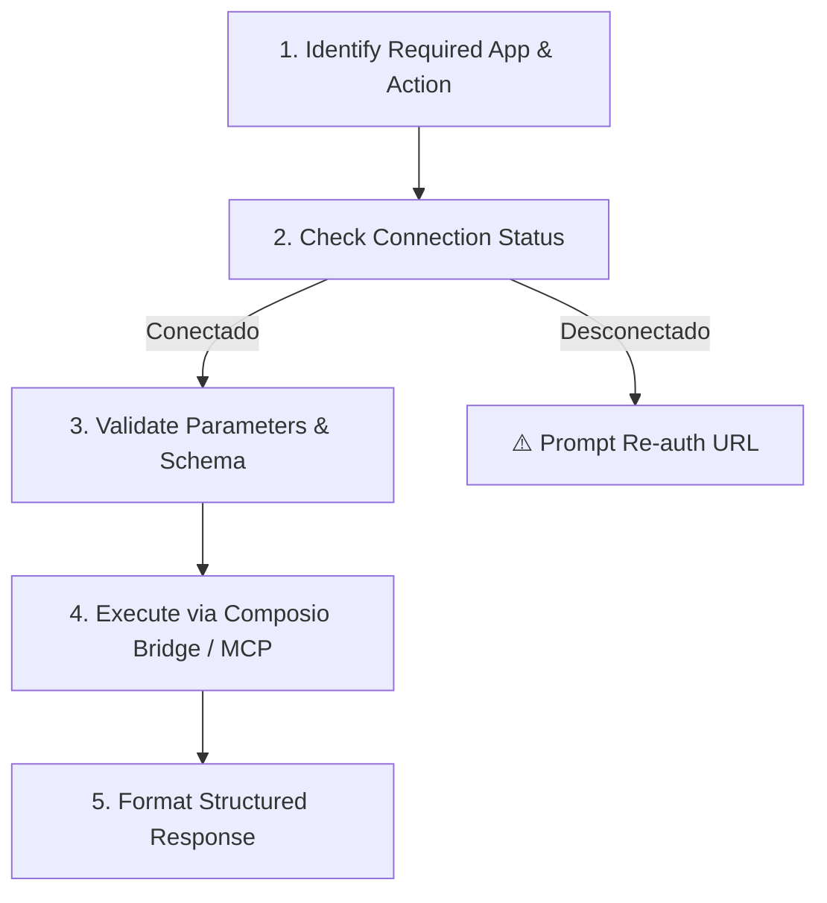

# Composio Tool Orchestrator

Capacidade de orquestração e execução segura de ferramentas externas através do **Composio** (via CLI instalada no WSL `~/.composio/composio`, bridge local ou endpoint MCP configurado em `mcp_config.json`).

---

## 🎯 Quando Usar

- Ao executar ações em serviços conectados (ex: criar issues no GitHub, enviar alertas no Slack, criar eventos no Google Calendar, atualizar registros no Salesforce).
- Ao auditar o status das integrações conectadas à conta `deivithi74@gmail.com`.
- Para disparar automações multi-aplicativo onde múltiplos conectores precisam ser encadeados com validação de payload.
- Para obter esquemas de parâmetros de chamadas de ferramentas (*tool calling schema*) do Composio.

## 🚫 Quando NÃO Usar (→ Handoff)

| Cenário | Skill recomendada |
|---|---|
| Automações no X / Twitter da conta `@opanteranegra77` | `openwiki-fio-synthesizer` / `openwiki-personal-brain` |
| Automação web pura baseada em DOM/navegador | `webwright` / `chrome-cdp` |
| Workflows visuais n8n | `n8n-workflow-patterns` / `n8n-node-configuration` |

---

## 🔐 Regras de Segurança e Isolamento

1. **Nunca expor chaves de API / Tokens em logs ou commits:** Autenticações OAuth e tokens de apps conectados são gerenciados no cofre do Composio.
2. **Confirmação para Ações Destrutivas:** Toda ação com impacto destrutivo ou de escrita em massa (ex: deleção de repositórios, broadcast em canais públicos de clientes, remoção de registros em CRM) deve ter parâmetros explicitamente validados antes do envio.
3. **Fallback Gracioso:** Se um conector retornar erro de autenticação ou rate limit, a skill deve capturar a resposta amigavelmente e sugerir reconexão no painel `https://dashboard.composio.dev/deivithi74_workspace/~/connect`.

---

## 🔄 Workflow de Execução



### 1. Checagem de Conexão
Executar o utilitário de diagnóstico:
```powershell
python skills/composio-tool-orchestrator/scripts/composio-bridge.py --check-status
```

### 2. Descoberta de Ferramentas
```powershell
python skills/composio-tool-orchestrator/scripts/composio-bridge.py --list-apps
```

### 3. Chamada Segura
Parâmetros são validados contra o schema do conector antes de enviar a requisição via WSL CLI ou endpoint MCP SSE (`https://connect.composio.dev/mcp`).

---

## 📚 Referências

- [`references/composio-apps-reference.md`](references/composio-apps-reference.md) — Lista de conectores, ações padrão e exemplos de payload.
- [Dashboard de Conexões Composio](https://dashboard.composio.dev/deivithi74_workspace/~/connect) — Gerenciamento de apps autenticados.
