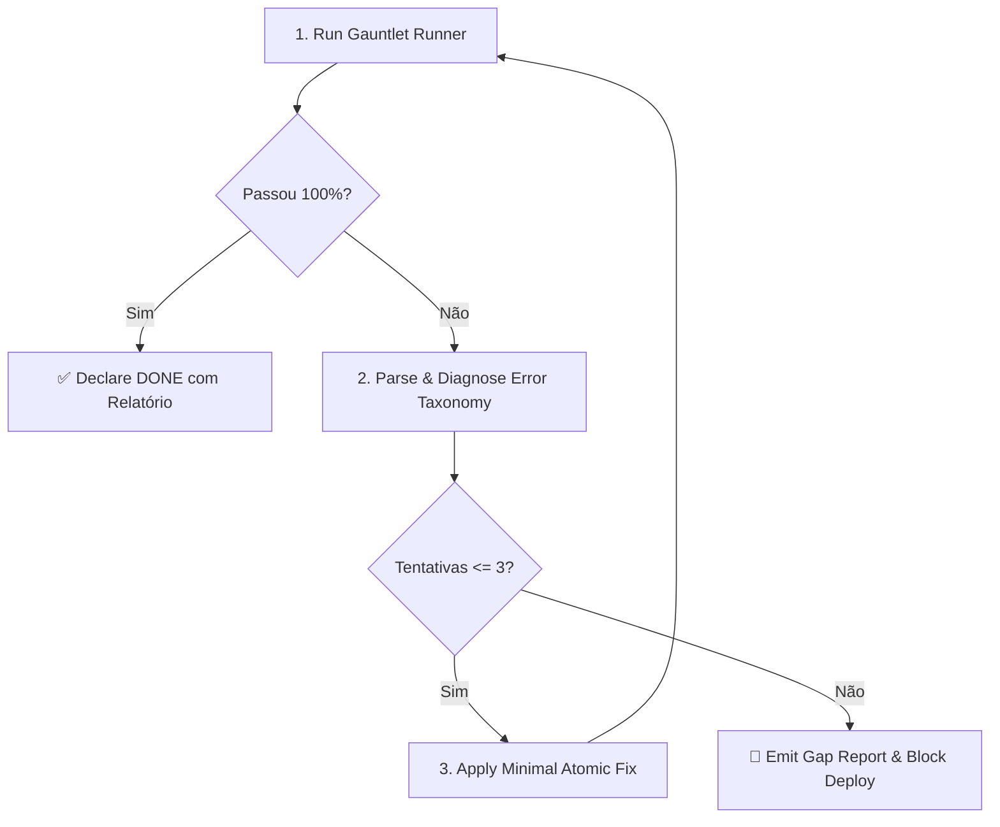

# Gauntlet Self-Healer

Motor de execução e **autocorreção autônoma** alinhado ao **ADR-008 (Gauntlet Protocol)**:
> *"O operador NÃO lê código gerado por agentes. A confiança vem exclusivamente do gauntlet automatizado. Done = passou o gauntlet."*

Esta skill assume o papel de rodar as suítes de verificação, interpretar traces de erro (compilação, tipos, lint, falhas de asserção em testes, brechas de cobertura) e aplicar correções cirúrgicas de forma iterativa.

---

## 🎯 Quando Usar

- Ao finalizar qualquer implementação de código (Python, TypeScript/Node, Go, Salesforce Apex, DRE) antes de declarar a tarefa como "concluída".
- Quando um comando de teste ou linter falhar durante o ciclo de desenvolvimento.
- Para rodar checagens pré-commit ou pré-deploy automáticas (`vibe-deploy-guard`).
- Para garantir que a cobertura de código satisfaça o limiar do projeto (mínimo padrão: **80%**).

## 🚫 Quando NÃO Usar (→ Handoff)

| Cenário | Skill recomendada |
|---|---|
| Auditoria profunda de vulnerabilidades de segurança (CVEs, SAST, DAST) | `security-audit` |
| Revisão de design de produto e requisitos de negócio | `product-verification` |
| Planejamento inicial de testes TDD antes de escrever código | `test-driven-development` |

---

## 🔄 Protocolo de Auto-Cura (4 Fases)



### Fase 1: Execução Estruturada
Execute o script runner multiplataforma:
```powershell
python skills/gauntlet-self-healer/scripts/gauntlet-runner.py --project-path .
```

### Fase 2: Diagnóstico via Taxonomia
Classifique a falha conforme [`references/gauntlet-error-taxonomy.md`](references/gauntlet-error-taxonomy.md):
- **Class 1 — Syntax / Type Error:** Correção mecânica na tipagem / import / declaração.
- **Class 2 — Lint / Formatting:** Ajuste via auto-fix (`ruff check --fix`, `eslint --fix`) ou correção de estilo.
- **Class 3 — Test Assertion Failure:** Investigar se a falha é na lógica do código ou no mock/massa de teste.
- **Class 4 — Coverage Gap:** Adicionar casos de teste direcionados aos branches não cobertos.

### Fase 3: Correção Cirúrgica (Atomic Fix)
- Aplicar apenas a alteração estritamente necessária para corrigir o ponto de falha.
- **NUNCA** apagar testes válidos ou adicionar `.skip` / `xfail` para mascarar falhas (violação direta do Gauntlet Protocol §1).

### Fase 4: Re-verificação e Limite de Iterações
- Re-executar o gauntlet runner.
- **Circuit Breaker:** Se após **3 iterações** o problema persistir, abortar o loop, emitir o **Gap Report** e acionar o operador.

---

## 📋 Mínimos Universais Suportados

| Stack | Comandos Executados |
|---|---|
| **Python** | `pytest -q`, `ruff check .`, `pytest --cov --cov-fail-under=80` |
| **Node.js / TS** | `npm test`, `npx tsc --noEmit`, `npx eslint . --max-warnings=0` |
| **Go** | `go test -race ./...`, `go vet ./...`, `golangci-lint run` |
| **DRE Eventos** | Backend (`pytest`, `ruff`) + Frontend (`npm test`, `tsc`) |
| **Salesforce** | `sf project deploy start --check-only`, `sf apex run test --synchronous` |

---

## 📚 Referências

- [`references/gauntlet-error-taxonomy.md`](references/gauntlet-error-taxonomy.md) — Taxonomia de erros e estratégias de autocorreção.
- [`rules/gauntlet-protocol.md`](../../rules/gauntlet-protocol.md) — Regra universal ADR-008.
