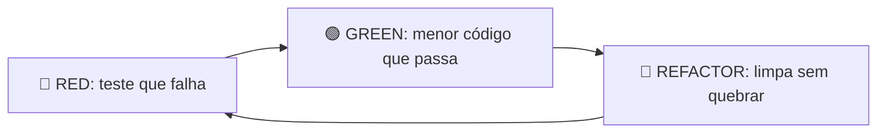

# 🧪 Test-Driven Development — Red · Green · Refactor

## 📁 File Structure

- `SKILL.md` — você está aqui. Protocolo completo.
- `gotchas.md` — armadilhas conhecidas.

## 🔗 Related Skills / Rules

- `alpha-loop` — itera código até os testes passarem. **TDD define os testes; alpha-loop itera até o verde.**
- `clean-code-rules` — aplicar no passo Refactor.
- `code-review` — revisão pós-verde, além dos testes.
- `rules/test-integrity.md` — proíbe deletar/skip/enfraquecer teste sem aceite. **Esta skill cria o teste; a rule o protege.**
- `rules/golang-activate.md` — TDD em Go (table-driven + `-race`).

---

## 🧠 Insight Central

> **O teste codifica a INTENÇÃO.** Código que passa num teste fraco não está correto —
> está apenas não-refutado. Escreva o teste que falharia se a intenção fosse violada.

Do vídeo Akita/Galego: _"TDD ficou barato com IA. Antes os devs não faziam porque não
queriam; agora o agente faz por você, custa um pouco de token a mais — e compensa."_

---

## 🔄 O Ciclo (Red → Green → Refactor)

### 🔴 RED — escreva o teste primeiro

1. Capture a **intenção** em palavras (1 linha) antes do código do teste.
2. Escreva o teste do menor incremento de comportamento.
3. **Rode e veja falhar** — um teste que nunca foi visto falhar não prova nada (pode estar testando o nada).
4. A falha deve ser pela razão certa (assertion), não por erro de import/sintaxe.

### 🟢 GREEN — menor código que passa

1. Implemente o **mínimo** para o teste passar. Nada de feature extra (anti token-maxing — ver `token-efficiency.md`).
2. Rode a suíte inteira, não só o teste novo.
3. Verde? Avance. Vermelho noutro teste? Você quebrou algo — corrija o **código** (nunca o teste; ver `test-integrity.md`).

### 🔵 REFACTOR — limpe com a rede de segurança

1. Com tudo verde, melhore nomes/estrutura/duplicação (`clean-code-rules`).
2. Rode a suíte a cada passo. Refactor que deixa vermelho é rollback, não "ajusto o teste".
3. **Não** adicione comportamento aqui — só forma. Comportamento novo = novo ciclo Red.

---

## 🎯 Testar intenção, não implementação

| ❌ Testa implementação (frágil)                      | ✅ Testa intenção (robusto)                                   |
| ---------------------------------------------------- | ------------------------------------------------------------- |
| Espia campos privados / chamadas internas            | Verifica o resultado observável / contrato                    |
| Quebra a cada refactor inocente                      | Só quebra se o comportamento mudar                            |
| `expect(spy).toHaveBeenCalled()` como única asserção | Verifica o efeito real (valor retornado, estado, side-effect) |
| Assert frouxo (`toBeTruthy`, `not None`)             | Assert do valor exato esperado                                |

Regra: se um refactor que preserva comportamento quebra o teste, o teste estava testando implementação.

---

## 🛠️ Ferramental padrão — comando de rodar testes por stack

> Referencie o comando no contexto do projeto (README/agents.md). O agente deve rodar
> **a suíte inteira** após cada Green/Refactor, não só o teste isolado.

| Stack             | Comando padrão                | Flags importantes                                        |
| ----------------- | ----------------------------- | -------------------------------------------------------- |
| **Go**            | `go test -race ./...`         | `-race` obrigatório; table-driven + `t.Parallel()`       |
| **Python**        | `pytest -q`                   | `pytest -q --cov` p/ cobertura; `-x` p/ parar no 1º fail |
| **Node (vitest)** | `npm test` / `npx vitest run` | `--coverage`; `vitest --watch` só em dev                 |
| **Node (jest)**   | `npx jest`                    | `--ci` em pipeline; `--coverage`                         |
| **Rust**          | `cargo test`                  | `cargo nextest run` quando disponível                    |
| **.NET**          | `dotnet test`                 | `--collect:"XPlat Code Coverage"`                        |

Não há comando? Detecte pelo manifesto (`go.mod`, `package.json` scripts.test, `pyproject.toml`, `Cargo.toml`) e registre o comando encontrado.

---

## ✅ Definição de Pronto (Definition of Done)

- [ ] Teste novo escrito **antes** do código e visto falhar (Red real).
- [ ] Suíte inteira verde — **sem** testes novos desabilitados (`skip`/`xfail`).
- [ ] Asserções testam intenção (não passam com implementação trivialmente errada).
- [ ] Coverage do código novo não caiu o threshold do projeto.
- [ ] Nenhum teste deletado/enfraquecido sem aceite (`rules/test-integrity.md`).
- [ ] Em Go: rodou com `-race`. Em concorrência: teste de corrida incluso.

---

## 🔁 Integração com adaptive-depth

O loop Red-Green é iterativo → `adaptive-depth.md` aplica: se 2 iterações seguidas sem
ganho (I(t) < 0.05) no número de testes passando, EXIT e replanejar (o problema pode ser
de design, não de implementação). Não iterar "no escuro".

---

## ⚠️ Quando pular TDD

- Mudança trivial de 1-2 linhas com comportamento óbvio (rename, typo, constante).
- Spike exploratório descartável (mas o código de produção que sair dele volta ao ciclo).
- Protótipo throwaway explicitamente marcado como tal.

Nunca pular em: lógica de negócio, parsing, cálculo financeiro (DRE/Pulso), auth, concorrência.
